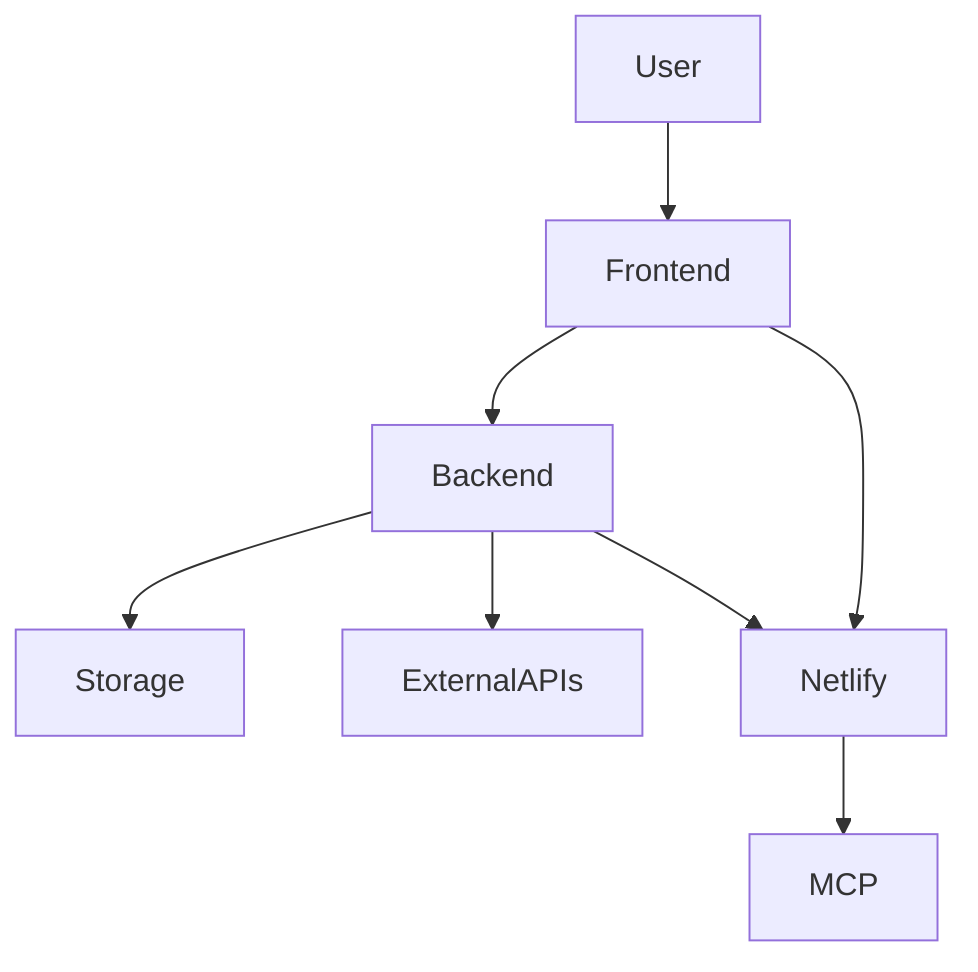

# Architecture Overview

## 1.4.1 Create Architecture Overview Document
- **Objective:** Summarize the overall system architecture.
- **Overview:**
  - Frontend: React + TypeScript (Vite)
  - Backend: Node.js (MCP server, Netlify functions)
  - Deployment: Netlify (static + serverless)
  - Storage: In-memory (processing), browser (export)
  - Security: GDPR/LGPD, authentication, encryption, access control

## 1.4.2 Document Technical Decisions and Rationale
- **Key Decisions:**
  - Use React for modular, maintainable UI
  - Use Vite for fast builds and HMR
  - Use serverless backend for scalability and cost
  - Use in-memory storage for privacy and compliance
  - Integrate with Netlify/MCP for CI/CD and deployment
- **Rationale:**
  - Prioritize performance, compliance, and developer experience

## 1.4.3 Create System Context Diagram
- **Diagram:**

## 1.4.4 Document Integration Points
- **Integration Points:**
  - Netlify: build, deploy, environment management
  - MCP server: backend API, serverless functions
  - External APIs: (optional) for advanced processing or analytics
  - Monitoring/alerting: Sentry, Datadog, etc.
- **Conclusion:**
  - The architecture is modern, modular, and designed for scalability, compliance, and rapid iteration. 