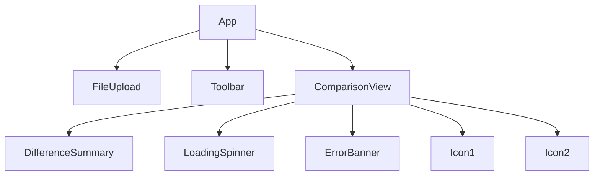

# Component Analysis

## 1.1.1 Map All React Components and Their Relationships
- **Objective:** Identify all major React components and their relationships.
- **Component List:**
  - `App.tsx`: Main application shell, state management, routing
  - `ComparisonView.tsx`: Displays document diffs
  - `FileUpload.tsx`: Handles file selection and upload
  - `Toolbar.tsx`: Provides UI controls for export, settings
  - `DifferenceSummary.tsx`: Summarizes diff statistics
  - `LoadingSpinner.tsx`, `ErrorBanner.tsx`, `Icon*`: UI/UX helpers
- **Relationships:**
  - `App` is the root, renders `FileUpload`, `ComparisonView`, `Toolbar`
  - `ComparisonView` uses `DifferenceSummary` and icons
  - `Toolbar` interacts with export and settings logic

## 1.1.2 Document Component Hierarchy and Communication Patterns
- **Hierarchy:**
  - `App`
    - `FileUpload`
    - `Toolbar`
    - `ComparisonView`
      - `DifferenceSummary`
      - `Icon*`
      - `LoadingSpinner`/`ErrorBanner`
- **Communication:**
  - Props: Data and callbacks passed from `App` to children
  - State: Centralized in `App`, lifted as needed
  - Events: File upload, diff request, export, error handling

## 1.1.3 Identify Reusable Components and Patterns
- **Reusable Components:**
  - `FileUpload`, `Toolbar`, `DifferenceSummary`, `LoadingSpinner`, `ErrorBanner`, `Icon*`
- **Patterns:**
  - Presentational/container split for UI logic
  - Custom hooks for file processing and API calls
  - Consistent use of props and callbacks

## 1.1.4 Create Component Interaction Diagram
- **Diagram:**

- **Conclusion:**
  - The component structure is modular and maintainable, with clear separation of concerns and reusable UI elements. 