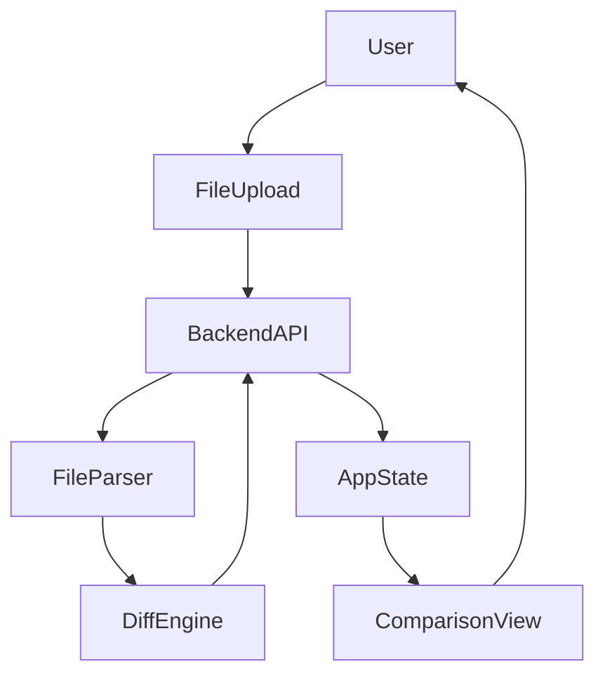

# Data Flow Analysis

## 1.2.1 Document Data Flow from File Upload to Diff Visualization
- **Objective:** Map the end-to-end flow of data from user upload to diff display.
- **Flow:**
  1. User uploads files via `FileUpload`
  2. Files sent to backend API (MCP/Netlify function)
  3. Backend processes files, extracts text, computes diff
  4. Diff result returned to frontend
  5. `App` updates state, passes diff to `ComparisonView`
  6. `ComparisonView` renders diff and summary

## 1.2.2 Map State Management Approach and Data Stores
- **State Management:**
  - Centralized in `App` (React state/hooks)
  - File data, diff results, UI state managed in root
  - Props/callbacks used for child communication
- **Data Stores:**
  - No external state management (Redux, MobX) used
  - Temporary in-memory storage on backend for processing

## 1.2.3 Identify Data Transformation Points
- **Transformations:**
  - File parsing (DOCX/PDF/TXT to text)
  - Diff computation (text to diff model)
  - Diff formatting (model to HTML/visual)
  - Export (diff model to PDF/CSV)

## 1.2.4 Create Data Flow Diagrams
- **Diagram:**

- **Conclusion:**
  - The data flow is linear and clear, with well-defined transformation points and state management centralized in the root component. 