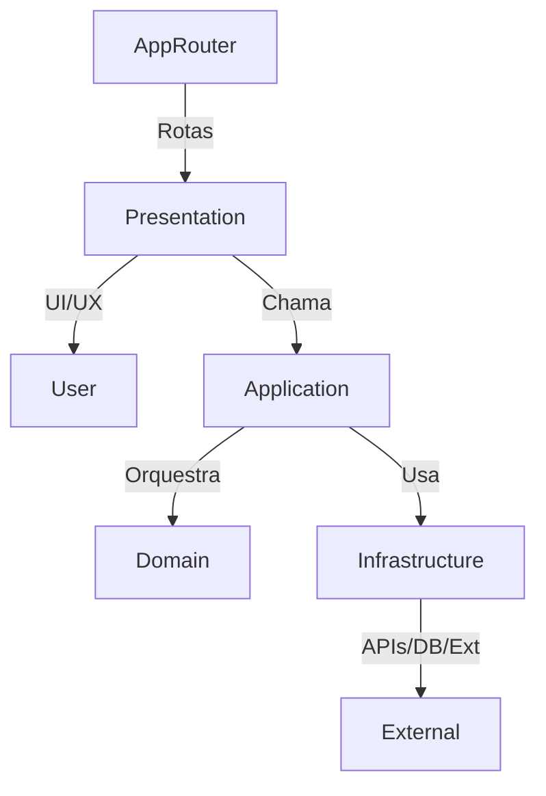

# ClauseDiff – Arquitetura e Decisões Técnicas

## Visão Geral
Este documento resume a arquitetura do ClauseDiff após a migração para Next.js 14, seguindo DDD (Domain-Driven Design) e Clean Architecture. O objetivo é garantir uma base escalável, testável e preparada para futuras expansões.

## Estrutura de Diretórios (DDD + Clean Architecture)
```
/app
  /api
  /auth/[...nextauth]/route.ts
  /contracts/route.ts
  /analysis/route.ts
  /(auth)
    /login/page.tsx
    /register/page.tsx
  /(dashboard)
    /page.tsx
    /contracts/page.tsx
    /analysis/[id]/page.tsx
    /comparison/[id]/page.tsx
/src
  /domain
    /entities
    /value-objects
    /repositories (interfaces)
    /services (interfaces)
  /application
    /use-cases
    /dto
    /services (implementations)
  /infrastructure
    /repositories (implementations)
    /external-services
    /database
    /storage
  /presentation
    /components
    /ui (atomic design)
    /forms
    /layouts
    /hooks
    /providers
    /utils
```

## Responsabilidades das Camadas
- **Domain:** Entidades, value-objects, interfaces de repositórios e serviços. Regras de negócio puras.
- **Application:** Use-cases, DTOs, serviços de aplicação. Orquestra lógica de negócio e integra domínios.
- **Infrastructure:** Implementações de repositórios, integrações externas (API, analytics, pagamentos), persistência.
- **Presentation:** Componentes React (Server/Client), UI, layouts, hooks, providers, utilitários.
- **App Router:** Rotas, layouts e entrypoints do Next.js 14.

## Decisões Técnicas
- **Next.js 14 App Router:** Estrutura moderna, suporte a Server/Client Components, Server Actions.
- **DDD + Clean Architecture:** Separação clara de responsabilidades, facilita testes e manutenção.
- **CQRS:** Separação de comandos (escrita) e queries (leitura) nos use-cases.
- **Internacionalização:** Suporte a pt, es, en via next-intl/i18next.
- **Acessibilidade:** Componentes e páginas seguindo WCAG.
- **Estado:** Context API (local), React Query (server), Zustand (global complexo).
- **Testes:** Jest + Testing Library, cobertura mínima de 90%.
- **Automação:** Deploy no Netlify, Husky para pre-commit, ESLint/Prettier.
- **Migração incremental:** Código legado em `/src/legacy` como fallback até migração total.

## Estratégia de Migração
- **Fase 1:** Setup Next.js 14, configuração base, código legado como fallback.
- **Fase 2:** Refatoração incremental para DDD + Clean Architecture.
- **Fase 3:** Otimizações, preparação para autenticação, integrações futuras.

## Extensibilidade
- **Autenticação:** Estrutura pronta em `/app/auth/[...nextauth]/route.ts` e `src/presentation/providers/AuthProvider.tsx`. Veja [auth-integration.md](./auth-integration.md).
- **Analytics:** Placeholder em `src/infrastructure/external-services/analytics.ts`.
- **Pagamentos:** Placeholder em `src/infrastructure/external-services/payments.ts`.

## Referências
- [PRD de Migração](../../tasks/prd-migracao-nextjs14.md)
- [Integração de Autenticação](./auth-integration.md)

## Diagrama (Simplificado)
